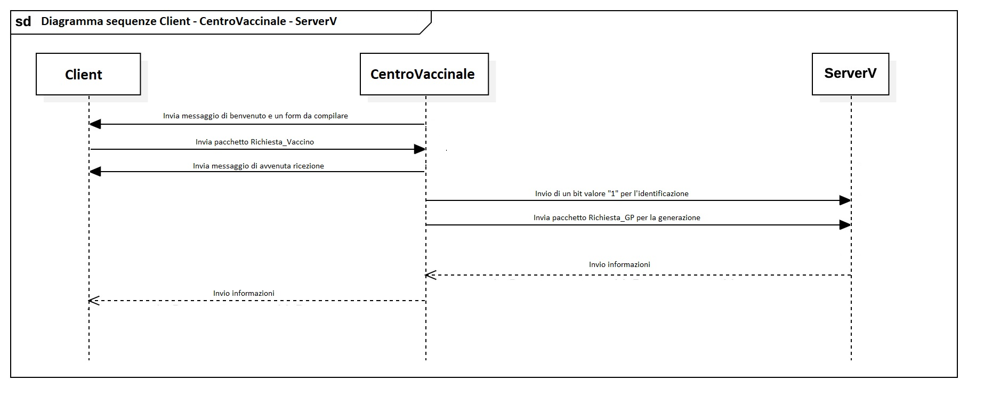

# Centro Vaccinale - Progetto di Reti di Calcolatori

Progetto sviluppato per il corso di Reti di Calcolatori presso l'Università degli Studi di Napoli Parthenope.  
Simula un sistema di comunicazione client-server per la gestione dei centri vaccinali.

## 📌 Linguaggio
- Linguaggio C (sockets TCP)
- Struttura client-server multipla

## 🧱 Struttura del progetto

- `/CodiceProgetto`: Contiene il codice sorgente in C per i client, i server e il centro vaccinale.
- `/Diagrammi`: Diagrammi UML e di sequenza del sistema.
- `/Documentazione`: Relazione tecnica in PDF e DOCX.
- `GreenPass.png`: Immagine dimostrativa.

## ⚙️ Funzionalità principali

- Comunicazione tra client e server tramite socket.
- Differenziazione logica tra server vaccinale e server generale.
- Gestione delle richieste di vaccinazione da più client.

## 📸 Esempi (Diagrammi)

---

**Autori:** Fabio Salese - Renzo Cerqua
📅 Anno accademico: 2022/2023
